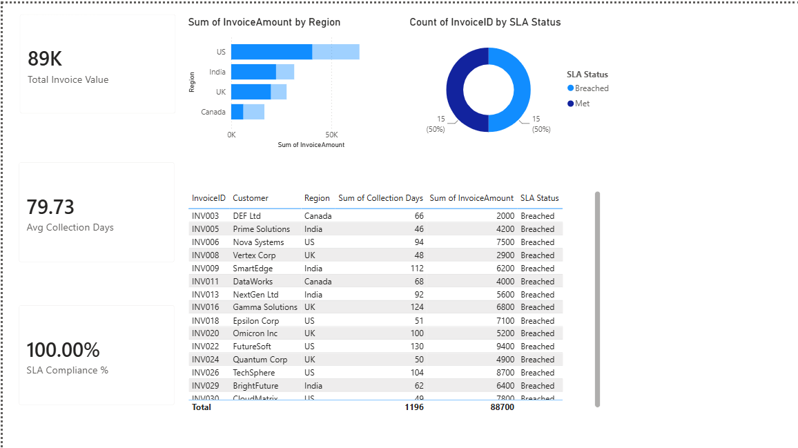

# PowerBI-O2C-Dashboard
Power BI dashboard for Order-to-Cash (O2C) analysis and SLA compliance monitoring.
# Order-to-Cash (O2C) Dashboard

## Overview
This Power BI dashboard analyzes Order-to-Cash performance using invoice and collection data.

## KPIs
- Total Invoice Value
- Average Collection Days
- SLA Compliance %
- Invoice Amount by Region
- SLA Status Distribution

## Tools Used
- Power BI
- DAX
- Excel

## Dashboard



## Key Insights
- Total Invoice Value: 89K
- Average Collection Days: 79.73
- SLA Compliance monitored using DAX measures
- US region generated the highest invoice value

## DAX Measures

### SLA Compliance %
```DAX
SLA Compliance % =
DIVIDE(
    CALCULATE(
        COUNTROWS(O2C_Data),
        O2C_Data[SLA Status] = "Met"
    ),
    COUNTROWS(O2C_Data)
)
